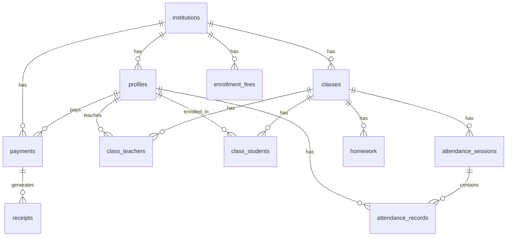

<p align="center">
  <h1 align="center">📚 Tadriss</h1>
  <p align="center">
    <strong>School Management Platform for Private Institutions</strong>
  </p>
  <p align="center">
    A modern, full-stack school management system built with Next.js, Expo, and Supabase.
  </p>
</p>

---

## Overview

**Tadriss** (تدريس — _teaching_ in Arabic) is an all-in-one platform for managing private educational institutions. It provides an admin web dashboard for school administrators and a mobile app for teachers and students.

### Key Features

| Feature                       | Description                                          |
| ----------------------------- | ---------------------------------------------------- |
| 🏫 **Institution Management** | Multi-tenant — each institution is fully isolated    |
| 👥 **User Roles**             | Admin, Teacher, Student with role-based access (RLS) |
| 📊 **Admin Dashboard**        | Real-time stats, enrollment charts, activity feed    |
| 📅 **Attendance**             | Session-based attendance with teacher/student views  |
| 📝 **Homework**               | Assign, track, and manage assignments per class      |
| 💳 **Payments**               | Fee management, payment tracking, receipt generation |
| 🔐 **Auth**                   | Email/password signup with institution onboarding    |
| 🌍 **i18n Ready**             | French & Arabic support with RTL layout              |

---

## Tech Stack

| Layer          | Technology                                                                                        |
| -------------- | ------------------------------------------------------------------------------------------------- |
| **Web App**    | [Next.js 16](https://nextjs.org/) + [Tailwind CSS v4](https://tailwindcss.com/)                   |
| **Mobile App** | [Expo](https://expo.dev/) + [NativeWind](https://www.nativewind.dev/) (Tailwind for React Native) |
| **Backend**    | [Supabase](https://supabase.com/) (Postgres, Auth, Edge Functions, RLS)                           |
| **Shared**     | TypeScript monorepo with shared types, validators, and constants                                  |
| **Monorepo**   | [pnpm](https://pnpm.io/) workspaces + [Turborepo](https://turbo.build/)                           |

---

## Project Structure

```
tadriss/
├── apps/
│   ├── web/                    # Next.js admin dashboard
│   │   ├── src/
│   │   │   ├── app/
│   │   │   │   ├── (auth)/     # Login, Signup, Reset Password
│   │   │   │   ├── (dashboard)/ # Main dashboard (protected)
│   │   │   │   ├── globals.css # Tailwind v4 theme + custom styles
│   │   │   │   └── layout.tsx  # Root layout (fonts, metadata)
│   │   │   ├── components/     # Sidebar, Header
│   │   │   ├── lib/supabase/   # Client, Server, Middleware helpers
│   │   │   └── middleware.ts   # Auth guard + session refresh
│   │   ├── postcss.config.mjs
│   │   └── tailwind.config.ts
│   │
│   └── mobile/                 # Expo React Native app
│       ├── app/
│       │   ├── _layout.tsx     # Root layout (NativeWind init)
│       │   ├── (student)/      # Student home screen
│       │   └── (teacher)/      # Teacher home screen
│       ├── babel.config.js
│       ├── metro.config.js
│       └── tailwind.config.js
│
├── packages/
│   └── shared/                 # Shared TypeScript package
│       ├── constants/          # Status enums, role definitions
│       ├── validators/         # Zod schemas (or manual validators)
│       └── supabase/           # DB types, query helpers
│
├── supabase/
│   ├── config.toml             # Supabase CLI config
│   ├── migrations/             # 9 SQL migration files
│   │   ├── 00001_infrastructure.sql
│   │   ├── 00002_create_institutions.sql
│   │   ├── 00003_create_profiles.sql
│   │   ├── 00004_create_classes.sql
│   │   ├── 00005_create_attendance.sql
│   │   ├── 00006_create_homework.sql
│   │   ├── 00007_create_payments.sql
│   │   ├── 00008_create_audit_log.sql
│   │   └── 00009_create_rls_policies.sql
│   ├── functions/              # Supabase Edge Functions (Deno)
│   │   ├── onboard-institution/
│   │   ├── dashboard-stats/
│   │   ├── invite-teacher/
│   │   ├── generate-receipt/
│   │   └── void-payment/
│   └── seed.sql
│
├── design/stitch/              # Original HTML design exports
├── dev.sh                      # Dev startup script
├── turbo.json                  # Turborepo pipeline config
└── package.json                # Root workspace config
```

---

## Getting Started

### Prerequisites

- **Node.js** ≥ 20
- **pnpm** ≥ 9.15
- **Docker** (optional — only needed for local Supabase)

### 1. Clone & Install

```bash
git clone <repo-url> tadriss
cd tadriss
pnpm install
```

### 2. Configure Environment

Create `.env.local` files for each app:

**`apps/web/.env.local`**

```env
NEXT_PUBLIC_SUPABASE_URL=https://your-project.supabase.co
NEXT_PUBLIC_SUPABASE_ANON_KEY=eyJ...your-anon-key
SUPABASE_SERVICE_ROLE_KEY=eyJ...your-service-role-key
```

**`apps/mobile/.env.local`**

```env
EXPO_PUBLIC_SUPABASE_URL=https://your-project.supabase.co
EXPO_PUBLIC_SUPABASE_ANON_KEY=eyJ...your-anon-key
```

> You can find these values in your [Supabase Dashboard → Settings → API](https://supabase.com/dashboard/project/_/settings/api).

### 3. Deploy Database

Link your Supabase project and push migrations:

```bash
npx supabase link --project-ref <your-project-ref>
npx supabase db push --include-all
```

### 4. Deploy Edge Functions

```bash
npx supabase functions deploy --project-ref <your-project-ref>
```

### 5. Run

```bash
# Start everything (requires Docker for local Supabase)
./dev.sh

# Or run individual apps
./dev.sh web      # Web only → http://localhost:3000
./dev.sh mobile   # Mobile only → Expo Go / browser
```

### 6. Production Deployment (Oracle Cloud)

The `tadriss-web` application is heavily optimized for zero-downtime deployment on Oracle Cloud Linux using a dual-layer reverse proxy stack.

**Architecture:**

- **Nginx (Port 3000):** Aggressively intercepts and streams all Next.js static Tailwind CSS (`/_next/static/`) directly from the SSD to mathematically eliminate Turbopack routing bugs.
- **PM2 (Port 3001):** Manages the headless generic `server.js` standalone Node instance in the background.

**To push a new update from your local Mac:**

1. Ensure your `apps/web/.env.local` contains all production Supabase keys
2. Run the deployment bash script natively (Requires SSH access to Oracle IP `84.8.223.50`):

```bash
./deploy_to_oracle.sh
```

_(The script will automatically compile Turbopack relative to `__dirname`, recursively `rsync` the nested files, forcefully inject the environment variables, and restart PM2 without physical server downtime)_.

---

## Database Schema



### Row Level Security

All tables are protected with RLS policies. Access is controlled via JWT claims:

- `get_institution_id()` — extracts institution from token (zero-query)
- `get_user_role()` — extracts role from token (zero-query)

| Role                | Access                                                          |
| ------------------- | --------------------------------------------------------------- |
| `institution_admin` | Full CRUD on all data within their institution                  |
| `teacher`           | Read classes, manage attendance & homework for assigned classes |
| `student`           | Read own enrollment, attendance, homework, payments             |

---

## Available Scripts

| Command                 | Description                                    |
| ----------------------- | ---------------------------------------------- |
| `pnpm run dev:web`      | Start Next.js dev server                       |
| `pnpm run dev:mobile`   | Start Expo dev server                          |
| `pnpm run build`        | Build all apps                                 |
| `pnpm run type-check`   | TypeScript check across all packages           |
| `pnpm run lint`         | Lint all packages                              |
| `pnpm run db:gen-types` | Generate TypeScript types from Supabase schema |

---

## Edge Functions

| Function              | Purpose                                              |
| --------------------- | ---------------------------------------------------- |
| `onboard-institution` | Creates institution + admin user + profile on signup |
| `dashboard-stats`     | Returns aggregated stats for the admin dashboard     |
| `invite-teacher`      | Sends invitation email for new teachers              |
| `generate-receipt`    | Creates PDF receipts for payments                    |
| `void-payment`        | Voids a payment (service role only, audit logged)    |

---

## License

Private — All rights reserved.
# TADRISS
# tadrtis
